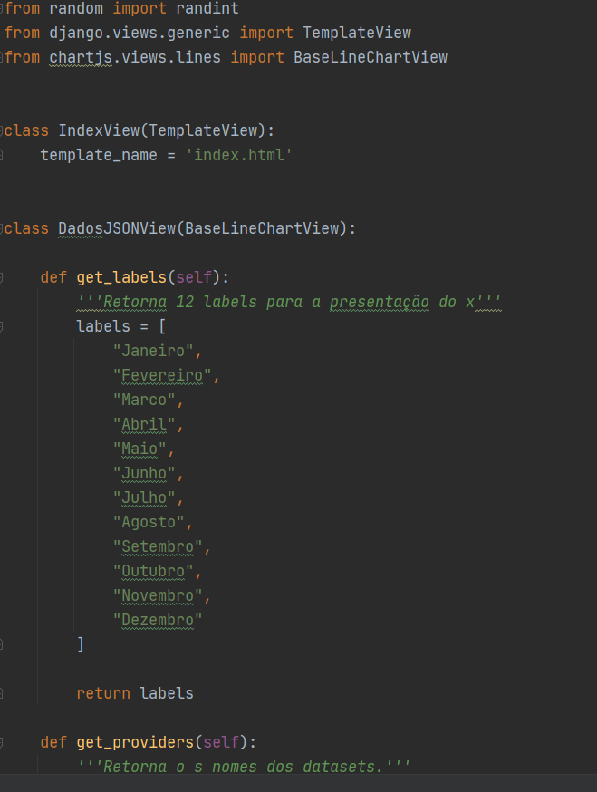
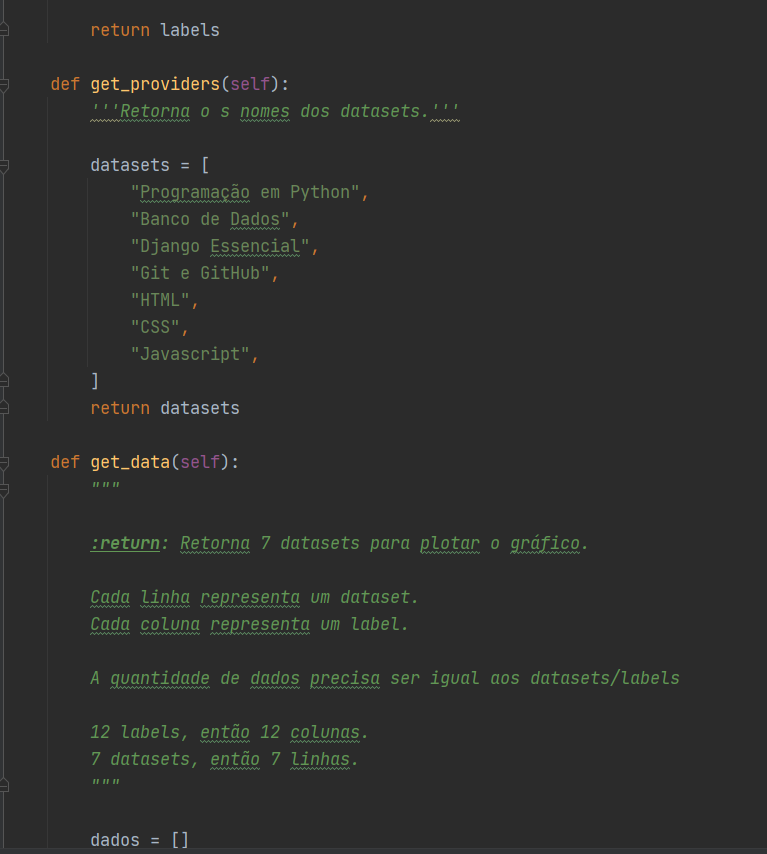
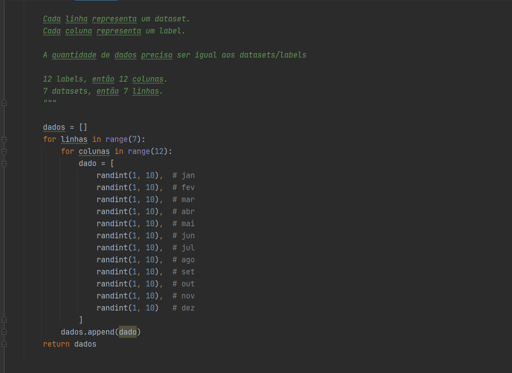
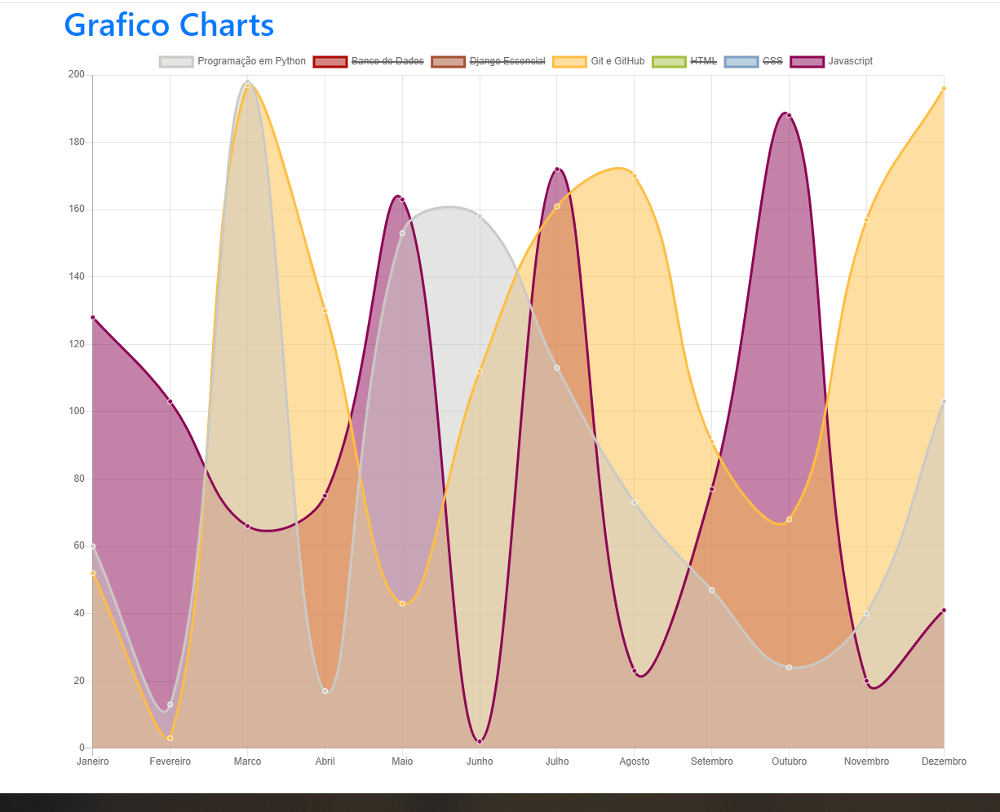

## Gerando Grafico com a Biblioteca Charts

> Gerando um grafico das atividades realizadas no mês.

A função do grafico é mostrar a quantidade das atividades feitas de cada
tecnologia estudada no mês.

### Ambiente de Desenvolvimento

> Tecnologias usadas: Python e Django, Javascript e Bootstrap.

